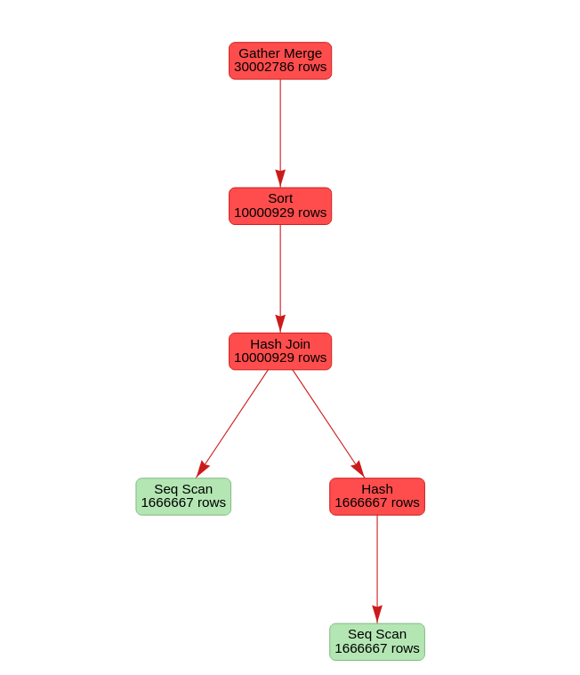

# PostgreSQL Plan Analyzer

A lightweight PostgreSQL execution plan analyzer that parses:

EXPLAIN (ANALYZE, FORMAT JSON)

and generates:

- Text-based diagnostics
- Warning detection
- Basic index suggestions
- An interactive HTML execution plan graph

## Features

- Detects bad row estimation (planner vs actual)
- Detects disk-based sorts (external merge)
- Detects hash spills (multiple hash batches)
- Flags expensive nodes relative to total execution time
- Suggests potential indexes when heavy filtering is detected
- Generates a hierarchical interactive execution tree (plan.html)

## Usage

### 1. Generate a JSON execution plan

Run inside PostgreSQL:

sql
EXPLAIN (ANALYZE, FORMAT JSON)
SELECT ...

### Save the output to a file

test_plan.json

### Run the analyzer

python3 analyzer_2.py test_plan.json

### Sample output

